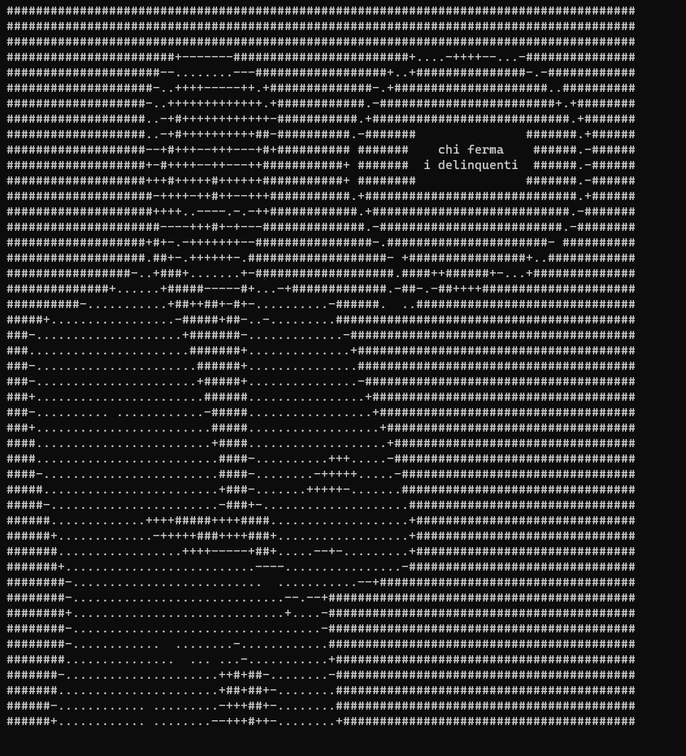

# salveenee — Procedural Stream-of-Consciousness Simulator 🗣️🎭

salveenee is a satirical command-line tool that procedurally simulates the rapid, list-style rhetoric associated with Matteo Salvini. It outputs an endless, randomized stream of keywords, places, and social groups rendered as terminal-friendly ASCII art to mimic the "catalogue" delivery often heard in public speeches and short social-media clips. 🎬🕒

## Inspiration 📺
This project was inspired by the Lo‑Fi Goliardica video (used only as inspiration, not part of the project).

[](https://www.youtube.com/watch?v=mNyethAqJzk)

Direct link: https://www.youtube.com/watch?v=mNyethAqJzk

---

## Screenshots 📸

  

---

## Features ✨
- Produces an endless, randomized stream of keywords, locations, and social groups.
- Renders output as ASCII art suitable for terminal display.
- Simple one-line installer that auto-detects architecture (amd64 / arm64). 🧭

---

## Installation 🚀

Automatic install:
```bash
curl -fsSL https://raw.githubusercontent.com/berik-99/salveenee/main/install.sh | bash
```

Manual install:
- Download the appropriate binary from the latest release: https://github.com/your-username/salveenee/releases/latest
- Make it executable:
```bash
chmod +x salveenee
```
- (Optional) Move it to a directory on your PATH:
```bash
sudo mv salveenee /usr/local/bin/
```

---

## Usage 🖥️

Start the stream:
```bash
salveenee
```

Stop: press `Ctrl + C`.

---

## Data & Behavior ⚙️
- The program draws from a curated set of phrases and nouns extracted from public, documented statements.
- It randomizes sequences for comedic effect and does not generate coherent political proposals.

---

## Satire & Disclaimer ⚠️📝
This project is an explicit PARODY provided solely for entertainment, educational, and research purposes. The project is exclusively satirical and does not intend to offend anyone.

---

## License 📜
MIT License — see `LICENSE` for full text.

Built with common sense, a pinch of irony, and plenty of bulldozers. 🚜😄